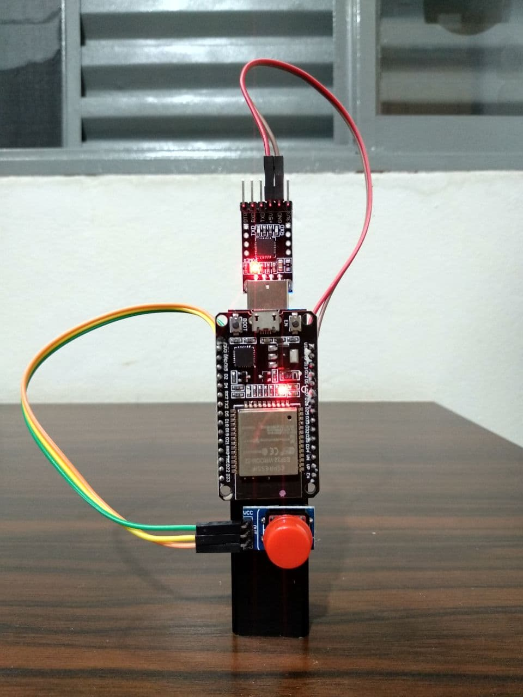
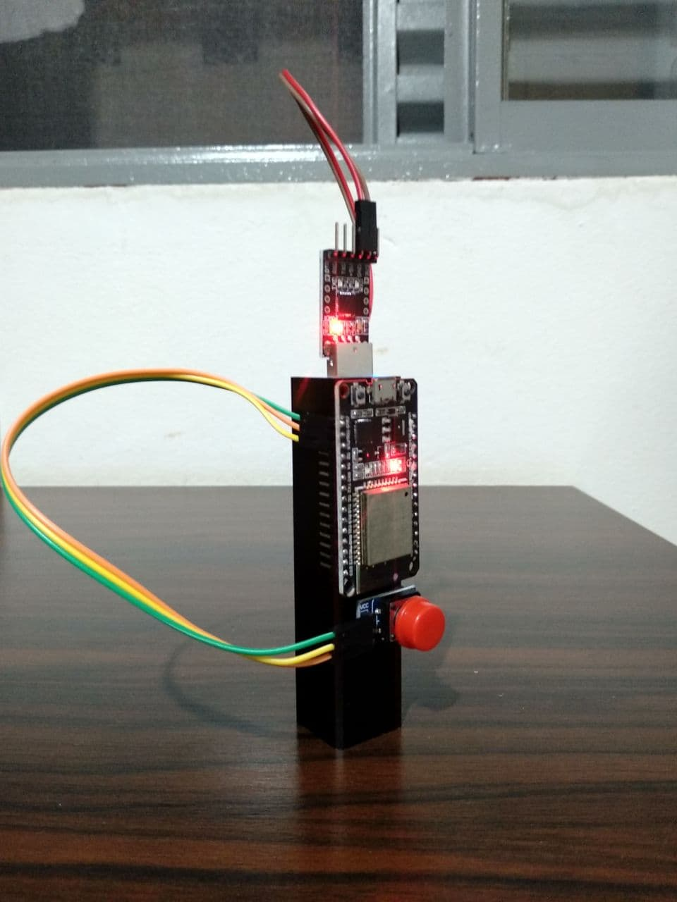

# over-engineered-mute-unmute-meet-button

## Que p**** é essa?

Incrível e absolutamente desnecessário dispositivo de controle remoto que muta/desmuta uma chamada no Google Meet através da rede local. _Overcomplicado,_ porém muito estiloso! :sunglasses:

 

## Como funciona?

- Metade da magia está ao enviar uma request POST usando a placa ESP32 conectada no wifi local
- A outra metade é um servidorzinho [Flask](https://flask.palletsprojects.com/en/2.0.x/) que escuta essas requests e usa a lib `keyboard` para dar `ctrl+d` na máquina

Funciona também se você pegar o seu mouse e simplesmente _clicar no botão_ de unmute, mas aposto que seu mouse não é tão legal quanto esse troço! :shipit:
